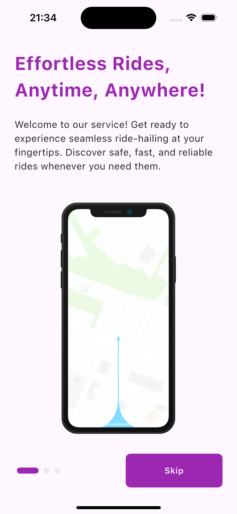
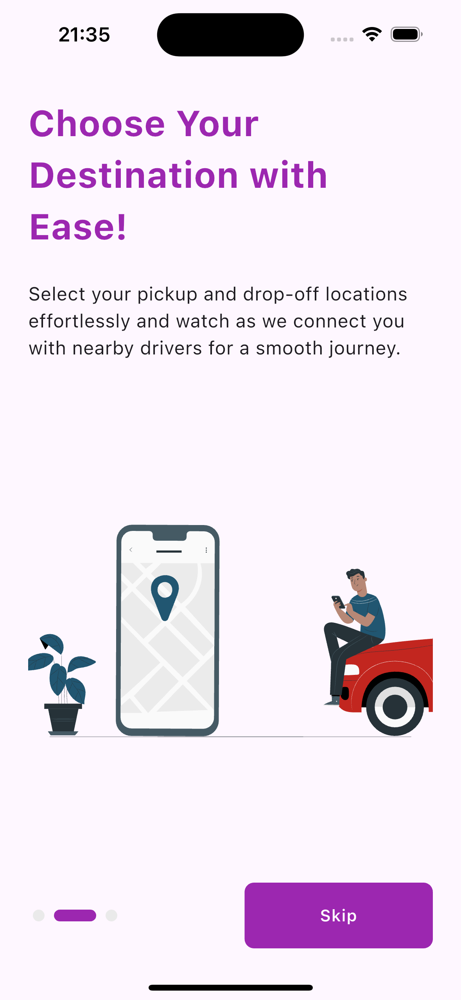
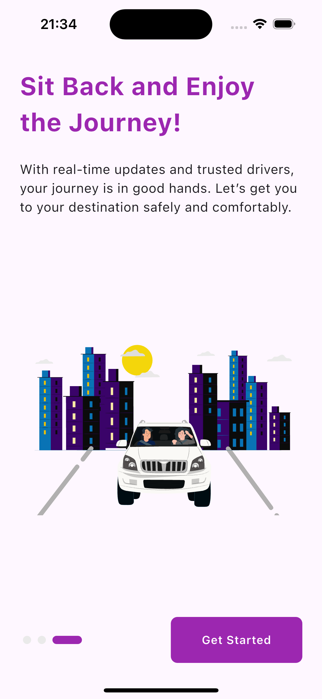
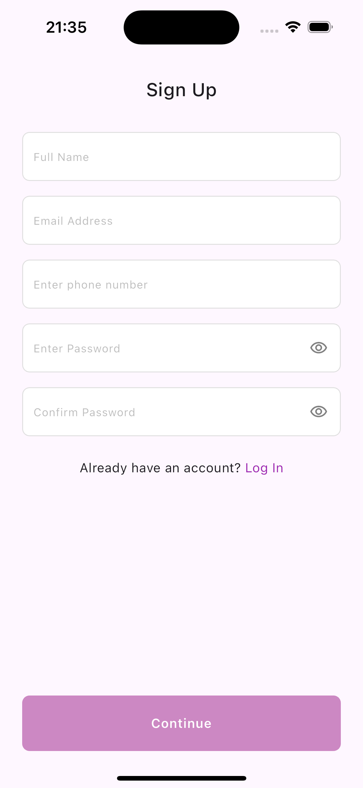
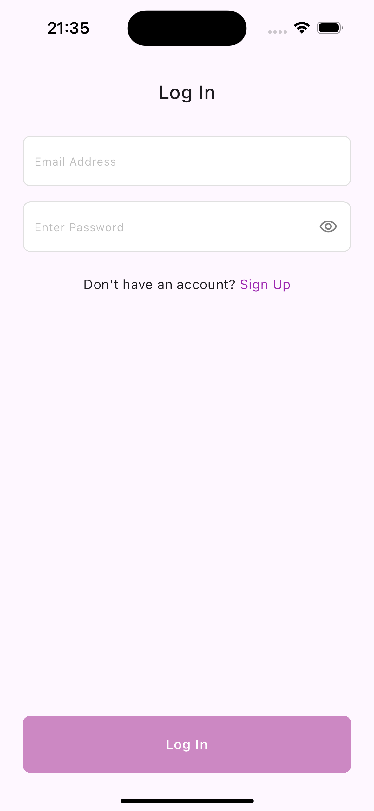
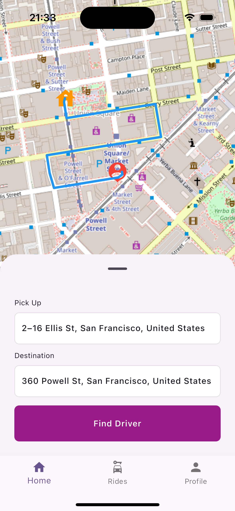
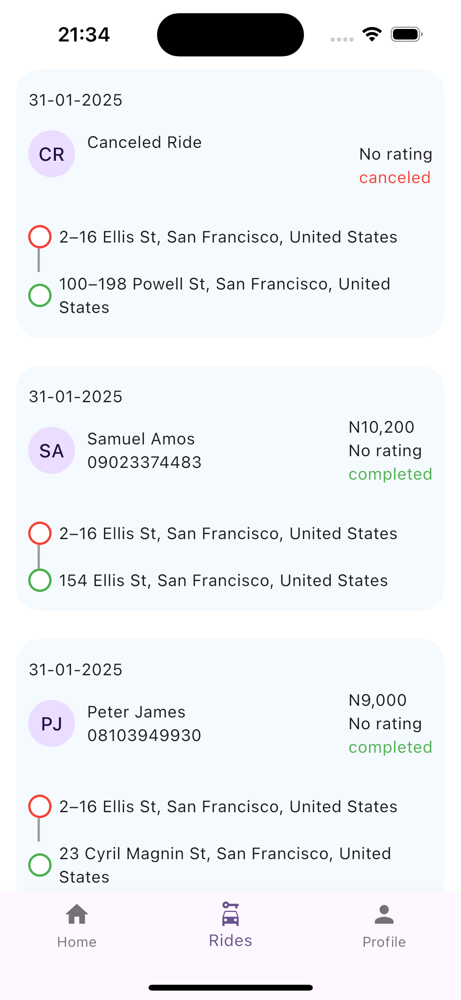
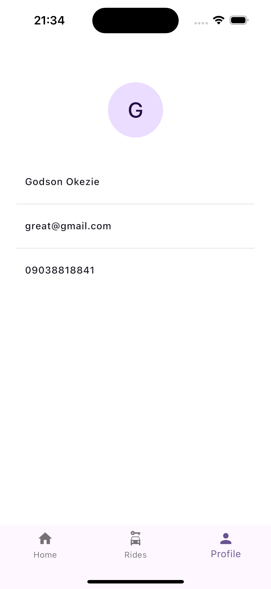

# JvecTask

A Flutter-based mobile application providing ride hailing service in a simulated architecture.

## Features

### 1. Authentication & Security

- Signup with name, email, phone number and password
- Login with email and password

### 2. Map Feature

- See current location on map with a marker
- Select a destination location on map

### 3. Ride Feature

- Find drivers
- Retry search when no driver is found after 15 seconds
- See ride history containing completed and canceled rides.

### Additional Features (Bonus Features)

- Poly-lines to show map directions from pickup location to destination.
- Phone Call with driver
- Chat with driver
- Share ride details
- Share location link accessible directly on google maps
- Profile page with current user details
- Driver rating after each ride

## Screenshots

|                  Onboarding Screen - 1                   |                  Onboarding Screen - 2                   | 
|:--------------------------------------------------------:|:--------------------------------------------------------:|  
|  |  |

|                  Onboarding Screen - 3                   |                   Signup Screen                    | 
|:--------------------------------------------------------:|:--------------------------------------------------:|  
|  |  |

|                   Login Screen                    |                   Map Screen                    | 
|:-------------------------------------------------:|:-----------------------------------------------:|  
|  |  |

|                       Ride History                       |                   Profile Screen                    | 
|:--------------------------------------------------------:|:---------------------------------------------------:|  
|  |  |

## Tech Stack

### Core Technologies

- **Framework**: Flutter (≥v3.27.0)
- **Language**: Dart (≥3.0.0)
- **State Management**: Get
- **Dependency Injection**: Get

### Architecture

This project uses clean architecture while maintaining the Model View Controller(MVC) pattern.
This architecture was chosen by me in order to maintain separation of concerns and scalability.
This architecture promotes reactive programming with GetX state management.

### Key Dependencies

- **Authentication**: `local_auth`
- **Networking**: `http`
- **Storage**: `local_auth`
- **UI Components**:`lottie`, `flutter_animate`
- **Location**: `geolocator`, `geocoding`
- **Map**: `flutter_map`

## Getting Started

### Prerequisites

- Flutter SDK ≥3.27.0
- Dart SDK ≥3.0.0
- Android Studio / VS Code
- Xcode (for iOS development)

### Installation

1. Clone the repository:

```bash
git clone [repository-url]
```

2. Install dependencies:

```bash
flutter pub get
```

3. Run on emulator/simulator:

```bash
flutter run
```

### Project Structure

```plaintext
lib/
├── app/                    // App initialization and configuration
├── core/                   // Core utilities and constants
├── modules/               // Feature modules
│   ├── authentication/
│   ├── dashboard/
│   ├── onboarding/
│   └── ...
└── shared/               // Shared components and services
```

### Contributing

1. Fork the repository
2. Create a feature branch
3. Commit your changes
4. Push to the branch
5. Create a Pull Request

### Minimum Requirements

- iOS 12.0 or later
- Android 6.0 (API 23) or later
- 2GB RAM minimum
- 100MB free storage